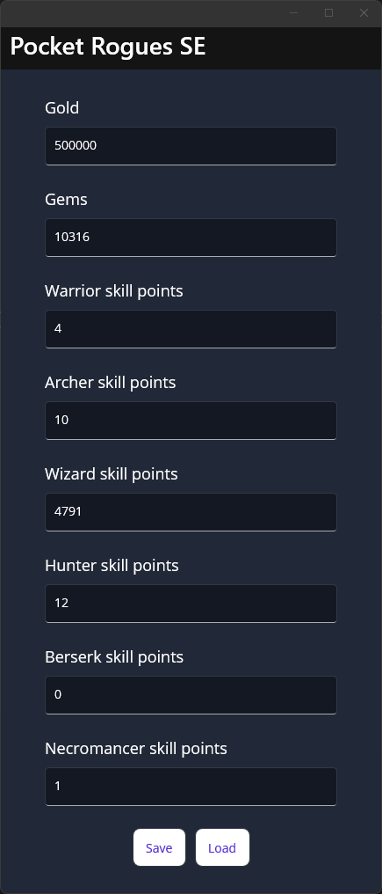

# Save Editor

A simple Pocket Rogues save editor

It is really simple to use :

First, open your game, go to Settings and click "Save (Local)" on the bottom of the screen"

Then, open the Save Editor and load your save file. On PC, it is located in "$GameFolder/Pocket Rogues_Data/PocketRogues Saves" (Usually somthing like "C:\Program Files (x86)\Steam\steamapps\common\Pocket Rogues\Pocket Rogues_Data\PocketRogues Saves")

Once it is loaded, change the values you want and press "Save".

Go back to your game, go to Settings and click "Load (Local)" on the bottom of the screen.

If anything, feel free to open an issue. I may look at it one day.
